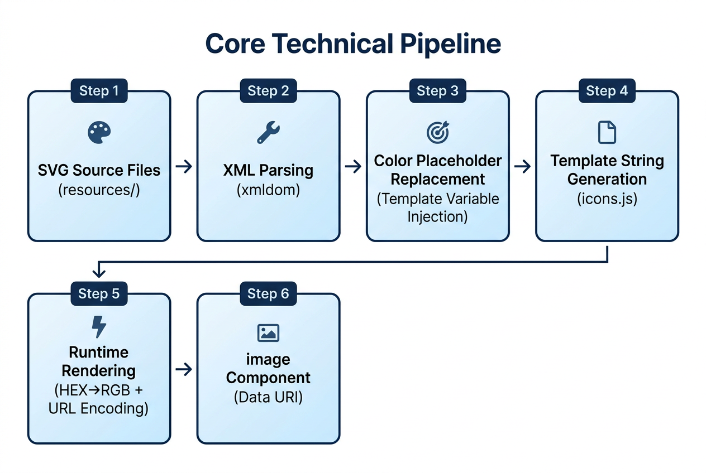

<h1 align="center">Miniprogram SVG Icons</h1>

<p align="center">
  <strong>🎨 Multi-color SVG Icon Solution for Mini Programs</strong>
</p>

<p align="center">
  Supports WeChat · QQ · Alipay · Kuaishou · Douyin · Baidu · Xiaohongshu · JD and 8 Major Platforms
</p>

<p align="center">
  <a href="https://www.npmjs.com/package/@mp-svg-icons/wechat">
    
  </a>
  <a href="https://github.com/anlyyao/miniprogram-svg-icons/blob/main/LICENSE">
    
  </a>
  
  
  
</p>

<p align="center">
  <a href="./README.md">简体中文</a> | <a href="./README_EN.md">English</a>
</p>

## 👀 Preview

Multi-color icon example mini program, please scan with WeChat to preview ↓


## ✨ Features

- 🎨 **Full Color Support** — Perfect rendering for single-color, dual-color, and multi-color icons
- 🔄 **Runtime Color Control** — Dynamically modify `fill` / `stroke` colors via properties
- 📦 **Zero Runtime Dependencies** — Data URI solution, no additional resource loading required
- 🌐 **8 Platform Support** — WeChat / QQ / Alipay / Kuaishou / Douyin / Baidu / Xiaohongshu / JD
- 🏷️ **Multi-brand Support** — Supports multiple icon brands (e.g., TDesign), easily extensible
- ✂️ **On-demand Tree Shaking** — Built-in CLI tool removes unused icons, reducing size by **99%+**

## 📦 Supported Platforms

| Package                                                                              | Platform                 | Notes                   |
| ------------------------------------------------------------------------------------ | ------------------------ | ----------------------- |
| [@mp-svg-icons/wechat](https://www.npmjs.com/package/@mp-svg-icons/wechat)           | WeChat Mini Program      | Reference platform      |
| [@mp-svg-icons/alipay](https://www.npmjs.com/package/@mp-svg-icons/alipay)           | Alipay Mini Program      | Independent API style   |
| [@mp-svg-icons/kuaishou](https://www.npmjs.com/package/@mp-svg-icons/kuaishou)       | Kuaishou Mini Program    |                         |
| [@mp-svg-icons/douyin](https://www.npmjs.com/package/@mp-svg-icons/douyin)           | Douyin Mini Program      | Requires quote escaping |
| [@mp-svg-icons/baidu](https://www.npmjs.com/package/@mp-svg-icons/baidu)             | Baidu Mini Program       | Requires quote escaping |
| [@mp-svg-icons/xiaohongshu](https://www.npmjs.com/package/@mp-svg-icons/xiaohongshu) | Xiaohongshu Mini Program |                         |
| [@mp-svg-icons/jd](https://www.npmjs.com/package/@mp-svg-icons/jd)                   | JD Mini Program          |                         |
| [@mp-svg-icons/utils](https://www.npmjs.com/package/@mp-svg-icons/utils)             | Utilities                | Icon tree-shaking CLI   |

> 💡 QQ Mini Program can directly use the WeChat Mini Program version.

## 🚀 Quick Start

### Installation

```bash
# WeChat Mini Program
npm install @mp-svg-icons/wechat

# Alipay Mini Program
npm install @mp-svg-icons/alipay

# Other platforms...
```

### Register Component

Register in page or component's `*.json` file:

```json
{
  "usingComponents": {
    "t-icon": "@mp-svg-icons/wechat/icon"
  }
}
```

### Use Icons

```xml
<t-icon name="add" size="{{48}}" />

<t-icon name="send" size="{{32}}" stroke-color="#0766ff" fill-color="#e70d0d" />

<t-icon name="robot-2" size="{{32}}" stroke-color="{{['#0052D9', '#e40a23']}}" fill-color="{{['#e1e50f', '#632bc9']}}" />
```

### Component Properties

| Property    | Type              | Default | Description                                 |
| ----------- | ----------------- | ------- | ------------------------------------------- |
| name        | String            | —       | Icon name (required)                        |
| size        | Number / String   | 24      | Icon size (px)                              |
| strokeColor | String / String[] | -       | Stroke color, supports HEX / rgb() / rgba() |
| fillColor   | String / String[] | -       | Fill color, supports HEX / rgb() / rgba()   |
| strokeWidth | Number            | 2       | Stroke width                                |
| brand       | String            | tdesign | Brand name                                  |

> 💡 Color values are internally converted to `rgb()` format before injection into Data URI. No need to manually escape HEX `#`.

## ✂️ Icon Tree Shaking

The icon component contains a full icon mapping (~1MB). It's recommended to use the tree-shaking tool for on-demand inclusion, **saving up to 99% size**.

### Install Tree Shaking Tool

```bash
npm install @mp-svg-icons/utils -D
```

### Usage

```bash
npx mp-svg-icons-clear --pkg-dir <path> [--scan <dirs...>] [--icons <names>] [--dry-run]
```

| Parameter   | Required | Description                                     |
| ----------- | :------: | ----------------------------------------------- |
| `--pkg-dir` |    ✅    | Path to the icon npm package directory          |
| `--scan`    |    -     | Project directories to scan (supports multiple) |
| `--icons`   |    -     | Comma-separated list of icon names              |
| `--dry-run` |    -     | Preview mode, no actual execution               |

### Examples

```bash
# Scan project and automatically identify used icons
npx mp-svg-icons-clear \
  --pkg-dir ./miniprogram_npm/@mp-svg-icons/wechat \
  --scan ./pages ./components

# Scan + add dynamic icons
npx mp-svg-icons-clear \
  --pkg-dir ./miniprogram_npm/@mp-svg-icons/wechat \
  --scan ./pages ./components \
  --icons loading,play

# Keep only specified icons
npx mp-svg-icons-clear \
  --pkg-dir ./miniprogram_npm/@mp-svg-icons/wechat \
  --icons add,close,check-circle

# Preview mode
npx mp-svg-icons-clear \
  --pkg-dir ./miniprogram_npm/@mp-svg-icons/wechat \
  --scan ./pages ./components \
  --dry-run
```

### Tree Shaking Results

| Scenario          | icons.js Size | Icon Count |  Savings  |
| ----------------- | :-----------: | :--------: | :-------: |
| Before            |     ~1 MB     |    2347    |     —     |
| After (10 icons)  |    ~4.3 KB    |     10     | **99.6%** |
| After (50 icons)  |   ~21.3 KB    |     50     | **97.9%** |
| After (100 icons) |   ~42.6 KB    |    100     | **95.7%** |

## ⚙️ Technical Solution

<p align="center">
  
</p>

<p align="center"><em>Core Technical Pipeline — Complete chain from SVG source files to mini program image component rendering</em></p>

## 📁 Project Structure

```
miniprogram-svg-icons/
├── resources/                    # SVG icon source files (organized by brand)
│   └── tdesign/                  #   TDesign icons (2347)
├── scripts/                      # Build scripts
│   ├── generate.ts               #   Generate components to packages/
│   ├── build.ts                  #   Bundle and compress to dist/
│   ├── release.ts                #   Interactive release tool
│   ├── shared.ts                 #   Shared modules (platform config, template generation)
│   ├── template/                 #   Component templates
│   │   ├── wechat.js.tpl         #     WeChat-style JS template
│   │   ├── alipay.js.tpl         #     Alipay-style JS template
│   │   ├── icon.tpl              #     View template
│   │   └── icon.json.tpl         #     Component config template
│   └── utils/
│       ├── svgTotemplate.ts      #   SVG parsing engine
│       └── const.ts              #   Special icon list
├── packages/                     # Source output (for development)
│   ├── wechat/                   #   WeChat mini program component
│   ├── alipay/                   #   Alipay mini program component
│   ├── kuaishou/                 #   Kuaishou mini program component
│   ├── douyin/                   #   Douyin mini program component
│   ├── baidu/                    #   Baidu mini program component
│   ├── xiaohongshu/              #   Xiaohongshu mini program component
│   ├── jd/                       #   JD mini program component
│   └── utils/                    #   Utilities (including tree-shaking CLI)
├── dist/                         # Release output (compressed)
├── package.json                  # Monorepo root configuration
└── pnpm-workspace.yaml           # pnpm workspace configuration
```

## 🛠️ Local Development

### Requirements

- [Node.js](https://nodejs.org/) >= 20
- [pnpm](https://pnpm.io/) >= 10

### Development Build

```bash
# Clone the project
git clone https://github.com/anlyyao/miniprogram-svg-icons.git
cd miniprogram-svg-icons

# Install dependencies
pnpm install

```

### Preview in Developer Tools

#### Import Project

Open [WeChat DevTools](https://developers.weixin.qq.com/miniprogram/dev/devtools/download.html), and import the `examples/example-svg-icon` folder.

#### Build npm

In WeChat DevTools, click the menu: **Tools → Build npm**, then you can preview the effect.

## 🔌 Extension Guide

### Add New Brand Icons

- Place SVG icon files in `resources/{brand}/` (filename is the icon name)
- Ensure SVG uses semantic `id` attributes to identify color regions (`fill1`, `fill2`, `stroke1`, `stroke2`)
- Run `pnpm run generate` to automatically identify and generate

### Add New Mini Program Platform

- **Step 1** — Add configuration in `scripts/shared.ts` `PLATFORMS`:

```typescript
newplatform: {
  id: 'newplatform',
  label: 'New Platform Mini Program',
  templateExt: '.nxml',
  styleExt: '.ncss',
  componentStyle: 'wechat',  // or 'alipay'
  escapeQuotes: false,
},
```

- **Step 2** — Add build commands in root `package.json`:

```json
{
  "generate:newplatform": "tsx scripts/generate.ts newplatform",
  "build:newplatform": "tsx scripts/build.ts newplatform"
}
```

- **Step 3** — Create package directory `packages/newplatform/`, add `package.json` and register in `pnpm-workspace.yaml`.

## 🤝 Contributing

Contributions are welcome! Please read the [Contributing Guide](./CONTRIBUTING.md) to learn how to participate in project development.

- 🐛 [Report Bug](https://github.com/anlyyao/miniprogram-svg-icons/issues)
- 💡 [Submit Suggestion](https://github.com/anlyyao/miniprogram-svg-icons/issues)
- 🔀 [Submit PR](https://github.com/anlyyao/miniprogram-svg-icons/pulls)

## 🔗 Related Links

- [TDesign Official Icon Library](https://tdesign.tencent.com/icons)

## 📄 License

[MIT](./LICENSE) © [anlyyao](https://github.com/anlyyao)

<p align="center">
  If this project helps you, please give it a ⭐️!
</p>
