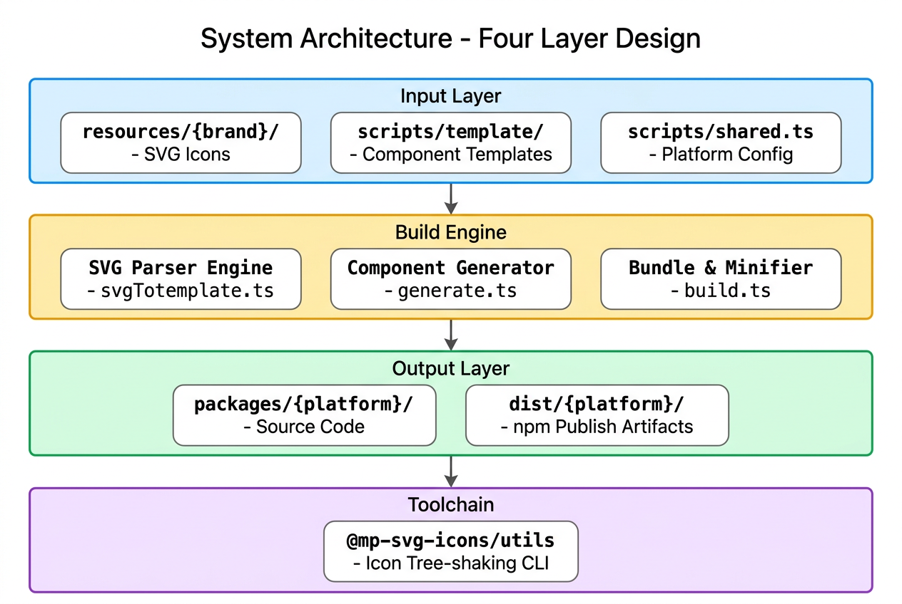
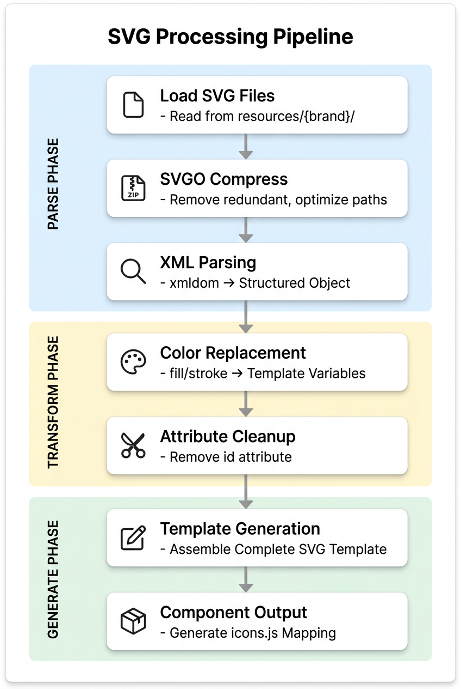
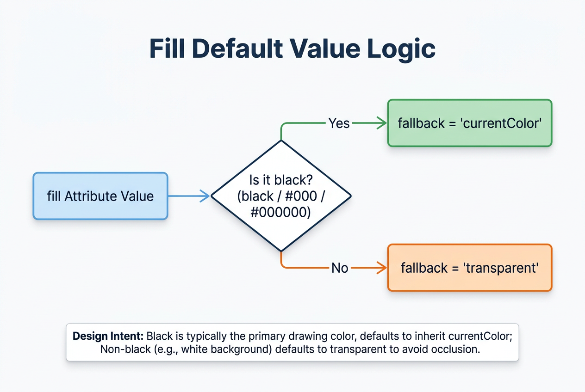
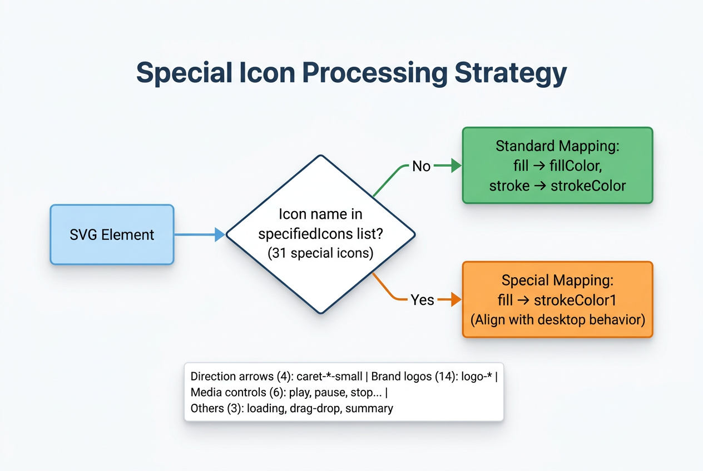
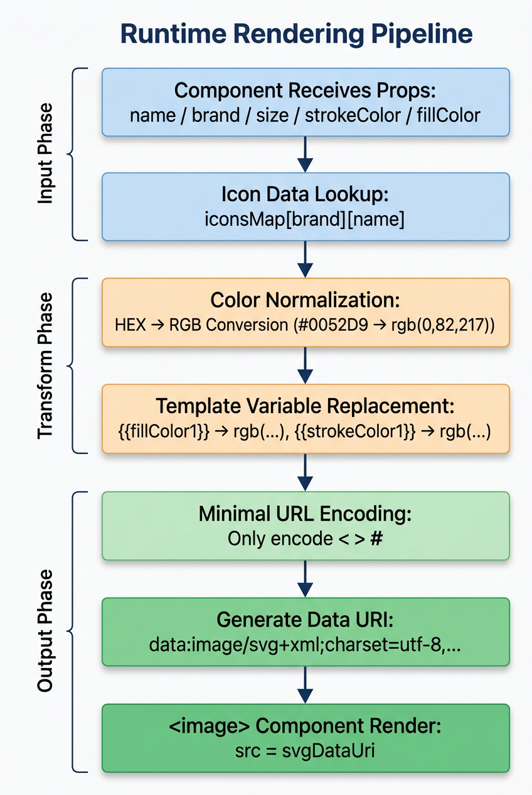
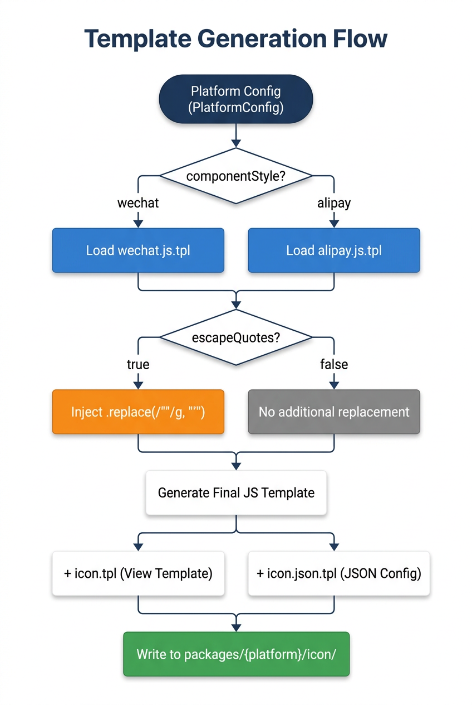
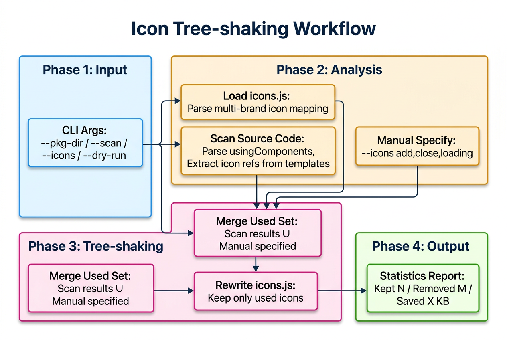

# 小程序多色 SVG 图标解决方案

<p align="center">
  支持 微信 · QQ · 支付宝 · 快手 · 抖音 · 百度 · 小红书 · 京东 | 8 大小程序平台
</p>

---

## 1. 项目概述

### 1.1 项目特性

- ✅ **完整色彩支持** — 单色、双色、多色图标完美渲染
- ✅ **运行时颜色控制** — 通过属性动态修改 `fill` / `stroke` 颜色
- ✅ **零依赖运行** — Data URI 方案，无需额外资源加载
- ✅ **8 大小程序平台适配** — 支持微信 / 支付宝 / 快手 / 抖音 / 百度 / 小红书 / 京东
- ✅ **多品牌支持** — 支持多品牌图标源（如 TDesign），易扩展
- ✅ **按需裁剪** — 内置 CLI 工具，移除未使用图标减小包体积

### 1.2 支持的平台

| 包名                                                                                 | 平台         | 备注             |
| ------------------------------------------------------------------------------------ | ------------ | ---------------- |
| [@mp-svg-icons/wechat](https://www.npmjs.com/package/@mp-svg-icons/wechat)           | 微信小程序   | 基准平台         |
| [@mp-svg-icons/alipay](https://www.npmjs.com/package/@mp-svg-icons/alipay)           | 支付宝小程序 | 独立 API 风格    |
| [@mp-svg-icons/kuaishou](https://www.npmjs.com/package/@mp-svg-icons/kuaishou)       | 快手小程序   |                  |
| [@mp-svg-icons/douyin](https://www.npmjs.com/package/@mp-svg-icons/douyin)           | 抖音小程序   | 需额外处理双引号 |
| [@mp-svg-icons/baidu](https://www.npmjs.com/package/@mp-svg-icons/baidu)             | 百度小程序   | 需额外处理双引号 |
| [@mp-svg-icons/xiaohongshu](https://www.npmjs.com/package/@mp-svg-icons/xiaohongshu) | 小红书小程序 |                  |
| [@mp-svg-icons/jd](https://www.npmjs.com/package/@mp-svg-icons/jd)                   | 京东小程序   |                  |
| [@mp-svg-icons/utils](https://www.npmjs.com/package/@mp-svg-icons/utils)             | 工具集       | 图标裁剪 CLI     |

> QQ 小程序可直接使用微信小程序版本。

### 1.3 核心价值

🎯 **解决真实痛点** — 几乎所有使用设计系统（TDesign、Ant Design、Vant 等）的小程序项目，都面临「如何在小程序中使用 SVG 图标」的问题。这个项目提供了一套**自动化、工程化、可维护**的完整方案。

🧩 **可复制的构建范式** — 模板分层 + 平台配置的方式，实现了「一套源码，多端输出」。

📦 **体积治理思路** — 「全量构建 + 后置裁剪」的模式，平衡了**开发便利性**和**产物体积**两个相互矛盾的需求。

## 2. 背景：小程序不支持内联 `<svg>` 标签

在现代前端开发中，SVG 是图标方案的绝对主流。它矢量清晰、颜色可控、体积小巧，Web 端的图标库几乎清一色使用 SVG 作为交付格式。但在小程序生态中，存在一个硬性限制——**小程序不支持 HTML 式的内联`<svg>` 标签**。

这意味着，你在 Web 端习以为常的写法：

```html
<svg xmlns="http://www.w3.org/2000/svg" width="14" height="14" viewBox="0 0 14 14" fill="none">
  <path
    d="M5.77496 7.72496V13.5H7.72496V7.72496H13.5V5.77496H7.72496V0H5.77496V5.77496H0V7.72496H5.77496Z"
    fill="#0052d9"
  />
</svg>
```

在小程序中完全无法生效。无论是微信、支付宝、抖音还是百度小程序，其模板引擎仅识别自身内置组件与规范标签，并不解析和渲染原生 `<svg>` 标签。也正因这一底层限制，想在小程序中使用设计系统图标库，就成了前端开发者必须解决的工程化问题。

**面对这一限制，我们有两种应对思路**：

- **硬碰硬** — 试图绕过或突破平台限制，例如通过 Canvas 重绘等「曲线救国」的方式；
- **以退为进** — 承认限制的存在，退一步选择小程序原生支持的渲染方式，再在此基础上「进阶」找回 SVG 的动态改色、多色支持等核心能力。
  后者正是本文所采用的技术策略。

## 3. 技术方案选型：以退为进

> 既然无法直接使用 `<svg>` 标签，那就换个思路——**用小程序原生支持的渲染方式，间接实现 SVG 图标能力**。

### 3.1 为什么不以「硬碰硬」的方式突破限制？

在面对平台限制时，一个直觉反应是试图绕过或突破它。但在小程序中使用 SVG 这个场景下，「硬碰硬」的代价过高：

- Canvas 绘制：需要解析 SVG 路径、处理视图缩放、逐帧绘制，性能开销大，实现复杂

### 3.2 技术方案：以退为进

| 方案                   | 渲染载体                                                    | 动态改色 | 多色支持 | 性能 | 结论 |
| :--------------------- | :---------------------------------------------------------- | :------: | :------: | :--: | :--: |
| 直接引用               | `<image src="xxx.svg"/>` / `background-image`               |    ❌    |    ❌    |  好  |  ❌  |
| Base64                 | `<image />` 标签 + Base64 / `background-image` + Base64     |    ❌    |    ❌    |  好  |  ❌  |
| CSS filter 改色        | `background-image` + `filter: hue-rotate()`                 |    ⚠️    |    ❌    |  好  |  ❌  |
| JS 动态拼接 + Data URI | `<image />` 标签 + Data URI / `background-image` + Data URI |    ✅    |    ✅    |  好  |  ✅  |

### 3.3 渲染方式选型：<image /> vs background-image

在「以退为进」的思路下，有两种可行的渲染方式：

| 对比维度   | `<image />` 标签                                             | `background-image`                                            |
| :--------- | :----------------------------------------------------------- | :------------------------------------------------------------ |
| SVG 缩放   | 原生支持矢量缩放（`mode="aspectFit"`）                       | 需配合 `background-size`                                      |
| 动态控制   | 支持 `mode` 属性控制裁剪/缩放                                | 仅 CSS 控制，灵活性差                                         |
| 懒加载     | 原生支持 `lazy-load`                                         | 无法实现                                                      |
| 错误处理   | 支持 `binderror` 监听加载失败                                | 无法监听                                                      |
| 跨平台兼容 | 全平台支持                                                   | ⚠️ Data URI 在 `url()` 中解析风险更高                         |
| 模板简洁度 | 一行搞定                                                     | 需要容器 + 复杂内联样式                                       |
| 性能考量   | 小程序的原生组件，由底层渲染引擎直接处理，解码和渲染路径更短 | CSS 属性，需要经过 CSSOM 解析 → 样式计算 → 图片解码的完整流程 |

**结论**：选择 `<image />` 标签作为 SVG 的渲染载体。

### 3.4 编码方案对比

将 SVG 嵌入 `<image />` 的 `src` 时，编码方式直接影响**最终体积**：

| 编码方案             | 原始 1202 字符 | 编码后大小 | 体积增幅 | 结论 |
| :------------------- | :------------: | :--------: | :------: | :--: |
| 最小化编码           |      1202      | 1259 字符  |  +4.7%   |  ✅  |
| Base64               |      1202      | 1630 字符  |  +35.6%  |  ❌  |
| `encodeURIComponent` |      1202      | 1633 字符  |  +35.9%  |  ❌  |

**最小化编码规则** — 仅编码 3 个必要字符：

| 原始字符 | 编码结果 | 原因                        |
| :------: | :------: | :-------------------------- |
|   `#`    |  `%23`   | 避免被解析为 URL 片段标识符 |
|   `<`    |  `%3C`   | 避免被解析为 HTML 标签      |
|   `>`    |  `%3E`   | 避免被解析为 HTML 标签      |

### 3.5 核心技术路线

<p align="center">
  
</p>

<p align="center"><em>图 3-1：核心技术路线 — 从 SVG 源文件到小程序 image 组件渲染的完整链路</em></p>

## 4. 架构设计与核心实现

### 4.1 整体架构

<p align="center">
  
</p>

<p align="center"><em>图 4-1：系统3层架构 — 输入层 / 构建引擎 / 输出层 </em></p>

---

### 4.2 构建时：SVG 处理引擎

上一节展示了系统的整体架构，接下来我们深入构建引擎的核心——SVG 处理引擎。这是整个方案的技术基石，负责将原始 SVG 源文件转换为支持动态颜色注入的组件代码。

#### 4.2.1 处理管道：7 步标准化流程

SVG 源文件经过 7 步处理，最终生成带模板变量的组件文件：

<p align="center">
  
</p>

<p align="center"><em>图 4-2：SVG 处理管道 — 解析阶段 / 转换阶段 / 生成阶段</em></p>

如上图所示，整个管道分为三个阶段：**解析阶段**先通过 `loadSvgs()` 读取 `resources/{brand}/` 下的源文件，再用 SVGO 压缩冗余信息、移除 `width`/`height`，最后由 xmldom 解析为结构化对象；**转换阶段**根据元素 `id` 将颜色值替换为模板变量（`normalizeColor()`），并清理 `id` 等仅构建时使用的属性（`buildAttrString()`）；**生成阶段**拼接出带模板变量的完整 SVG 字符串（`generateSvg()`），并汇总输出为 `icons.js` 映射表（`generateIconsJS()`），供运行时按需取用。

了解了处理管道的各个步骤后，我们深入转换阶段的核心环节——**颜色映射规则**。只有建立清晰的映射体系，才能实现运行时动态改色的能力。

#### 4.2.2 颜色映射：从 id 到模板变量

SVG 源文件中使用**语义化 `id` 属性**标识颜色区域，构建时自动映射为运行时模板变量：

| SVG 属性 | 元素 id   | 映射变量 | 默认值                         |
| :------- | :-------- | :------- | :----------------------------- |
| `fill`   | `fill1`   | `{{f1}}` | `currentColor` / `transparent` |
| `fill`   | `fill2`   | `{{f2}}` | `currentColor` / `transparent` |
| `stroke` | `stroke1` | `{{s1}}` | `currentColor`                 |
| `stroke` | `stroke2` | `{{s2}}` | `currentColor`                 |

> 💡 此外，`stroke-width` 属性的变量化不依赖特定 `id`——只要元素存在 `stroke` 属性（且不为 `none`），即自动将其 `stroke-width` 替换为 `{sw}`（运行时通过 `strokeWidth` 属性控制，默认值 `2`）。

**示例映射**：

```xml
<!-- 源文件 -->
<path id="fill1" fill="#000000" d="..."/>
<path id="stroke1" stroke="#333333" d="..."/>

<!-- 转换后 -->
<path fill="{{f1 || 'currentColor'}}" d="..."/>
<path stroke="{{s1 || 'currentColor'}}" d="..."/>
```

#### 4.2.3 默认值策略：智能判定填充色

fill 属性的默认值根据原始颜色值动态决定：黑色继承 currentColor，其他值默认 transparent

<p align="center">
  
</p>

<p align="center"><em>图 4-3：fill 默认值判定</em></p>

> 💡 **设计意图**：黑色通常是主要绘制色，默认继承 `currentColor`；非黑色（如白色背景）默认透明，避免遮挡。

#### 4.2.4 特殊图标：差异化映射规则

31 个特殊图标（品牌 Logo、媒体控制类）需要差异化的颜色映射策略：

> 详见 `scripts/utils/const.ts` 中的 `specifiedIcons` 列表。

<p align="center">
  
</p>

<p align="center"><em>图 4-4：特殊图标处理策略 — 标准映射 vs 特殊映射</em></p>

特殊图标处理规则确保了品牌 Logo 等图标的颜色正确性。至此，我们已经完成了 SVG 处理逻辑的设计，接下来需要关注的是**如何在构建过程中对 SVG 进行多层次的优化**，以减小最终产物的体积。

#### 4.2.5 优化策略：多层次体积压缩

- **SVGO 预压缩**（构建时第一步）：

使用 [SVGO](https://github.com/svg/svgo) 对原始 SVG 进行预压缩，显著减小文件体积：

| 优化项                  | 说明                                         |
| :---------------------- | :------------------------------------------- |
| 移除 `width` / `height` | 尺寸由 CSS 控制，在压缩阶段统一移除          |
| 移除无用声明            | DOCTYPE、XML 声明、注释、元数据、编辑器信息  |
| 移除冗余标签            | `<title>`、`<desc>`、空 `<defs>`、空容器     |
| 优化路径数据            | 合并路径、简化路径命令、精简数值精度         |
| 形状转路径              | `<circle>`、`<rect>` 等转为更紧凑的 `<path>` |
| 颜色压缩                | `#ffffff` → `#fff`，使用简写十六进制         |
| 属性清理                | 移除默认值属性、空属性、未使用的命名空间     |

> 💡 **关键保留**：`id` 属性（如 `fill1`、`stroke1`）在 SVGO 阶段保留，供后续颜色映射使用，最终在模板生成阶段移除。

- **模板转换优化**（构建时后续步骤）：

| 优化项            | 说明                     |
| :---------------- | :----------------------- |
| 移除 `id` 属性    | 仅构建时使用，不进入产物 |
| 颜色 → 模板占位符 | 支持运行时动态注入       |
| 特殊图标差异化    | 31 个特殊映射规则        |

- **编码时优化**：

| 优化项          | 说明                        |
| :-------------- | :-------------------------- |
| 最小化 URL 编码 | 仅编码 `<` `>` `#` 三个字符 |
| 双引号 → 单引号 | 百度/抖音平台兼容处理       |

> ⚠️ **注意**：百度、抖音小程序的 image 组件在解析 Data URI 时，SVG 中的双引号会导致错误。因此这两个平台额外进行 `"` → `'` 替换处理。

构建时的 SVG 处理引擎已经将 SVG 源文件转换为带模板变量的组件代码。接下来，我们将视角切换到**运行时**，看看组件是如何将这些构建产物渲染到用户界面上的。

### 4.3 运行时：渲染机制

<p align="center">
  
</p>

<p align="center"><em>图 4-5：运行时渲染管道 — 从组件属性到 image 渲染的完整流程</em></p>

如上图所示，运行时渲染同样分为三个阶段：**输入阶段**接收 `name`/`brand`/`size`/`strokeColor`/`fillColor` 等组件属性，并通过 `iconsMap[brand][name]` 取出对应的 SVG 模板；**转换阶段**先将传入的 HEX 颜色统一标准化为 `rgb()` 格式（如 `#0052D9` → `rgb(0,82,217)`），再把 SVG 模板中的 `{{fillColor1}}` 等占位变量替换为最终颜色值；**输出阶段**对结果做最小化 URL 编码（仅转义 `<`、`>`、`#`），拼接成 `data:image/svg+xml;charset=utf-8,...` 的 Data URI，赋给 `image` 组件的 `src` 完成渲染。

> 💡 颜色值内部统一转为 `rgb()` 格式后注入 Data URI，HEX 的 `#` 无需手动转义。

运行时渲染机制确保了在单一平台上的正确显示。然而，我们的目标是**一套源码，多端输出**。接下来看看如何通过配置驱动的模板生成，实现跨平台适配。

---

### 4.4 跨平台：自动化模板生成

#### 4.4.1 配置驱动：平台适配体系

每个平台通过 5 个维度的配置描述，构建引擎根据配置**自动生成**对应平台的组件代码：

```typescript
interface PlatformConfig {
  id: string; // 平台标识
  label: string; // 显示名称
  templateExt: string; // 模板文件后缀
  styleExt: string; // 样式文件后缀
  componentStyle: 'wechat' | 'alipay'; // 组件 API 风格
  escapeQuotes: boolean; // 是否需要额外转义双引号
}
```

#### 4.4.2 平台差异：8 大平台对比

| 平台   | 模板后缀 | 样式后缀 | 组件风格 | 双引号转义 | 备注           |
| :----- | :------- | :------- | :------: | :--------: | :------------- |
| 微信   | `.wxml`  | `.wxss`  |  wechat  |     ❌     | 基准平台       |
| QQ     | —        | —        |    —     |     —      | 直接使用微信包 |
| 快手   | `.ksml`  | `.css`   |  wechat  |     ❌     | —              |
| 小红书 | `.xhsml` | `.css`   |  wechat  |     ❌     | —              |
| 京东   | `.jxml`  | `.jxss`  |  wechat  |     ❌     | —              |
| 百度   | `.swan`  | `.css`   |  wechat  |     ✅     | 需转义双引号   |
| 抖音   | `.ttml`  | `.ttss`  |  wechat  |     ✅     | 需转义双引号   |
| 支付宝 | `.axml`  | `.acss`  |  alipay  |     ❌     | 独立 API 风格  |

#### 4.4.3 API 差异

| 特性     | 微信风格（6 个平台）                      | 支付宝风格                       |
| :------- | :---------------------------------------- | :------------------------------- |
| 属性定义 | `properties: { type: String, value: '' }` | `props: { name: '', size: 24 }`  |
| 数据访问 | `this.data.xxx`                           | `this.props.xxx`                 |
| 初始化   | `lifetimes.attached()`                    | `didMount()`                     |
| 属性监听 | `observers: 'name, brand, size, ...'`     | `didUpdate(prevProps)` 手动 diff |

#### 4.4.4 生成流程：从配置到组件

<p align="center">
  
</p>

<p align="center"><em>图 4-6：模板生成流程 — 从平台配置到组件文件写入</em></p>

> **核心优势**：7 个平台仅需维护 **2 套 JS 模板** + **1 个视图模板** + **1 个 JSON 配置**，新增平台仅需在 `PLATFORMS` 中注册一行配置。

跨平台模板生成解决了多端适配的问题，但引入了一个新挑战：**全量图标库的体积**。

### 4.5 体积优化：构建后裁剪

#### 4.5.1 体积问题：全量图标的代价

TDesign 图标库包含 **2347** 个图标。构建产物中，通用 icon 组件的 `icons.js` 映射表单文件就接近 **1MB**，远超小程序的合理范围。

即使开发者只用了 20 个图标，也必须全量引入——这显然不合理。

#### 4.5.2 裁剪方案：智能 CLI 工具

项目提供了 `@mp-svg-icons/utils` 裁剪工具，在**构建后、发布前**对产物进行裁剪：

<p align="center">
  
</p>

<p align="center"><em>图 4-7：图标裁剪工作流 — 输入 / 分析 / 裁剪 / 输出四阶段</em></p>

#### 4.5.3 扫描机制：两阶段精准识别

扫描器采用**两阶段**策略精确识别图标引用：

| 阶段   | 扫描对象          | 提取内容               | 说明                            |
| :----- | :---------------- | :--------------------- | :------------------------------ |
| 阶段一 | 所有 `.json` 文件 | `usingComponents` 配置 | 收集自定义标签名（如 `t-icon`） |
| 阶段二 | 所有模板文件      | `<t-icon name="xxx"/>` | 提取 `name` 和 `brand` 属性     |

> 所有匹配结果与全量图标名取交集，避免误识别

#### 4.5.4 裁剪效果：从 1MB 到几 KB

裁剪工具重写 `icons.js` 文件，只保留使用中的图标条目：

> 基于图标库实际构建产物（2347 个图标，平均 SVG 大小 ~435 B），按中位数均匀抽样选取图标，模拟不同使用量下的体积表现

| 场景                 | `icons.js` 大小 | 图标数量 | 节省比例 |
| :------------------- | :-------------: | :------: | :------: |
| 裁剪前               |      ~1 MB      | 2347 个  |    —     |
| 裁剪后（10 个图标）  |     ~4.3 KB     |  10 个   |  99.6%   |
| 裁剪后（50 个图标）  |    ~21.3 KB     |  50 个   |  97.9%   |
| 裁剪后（100 个图标） |    ~42.6 KB     |  100 个  |  95.7%   |
| 裁剪后（150 个图标） |    ~63.9 KB     |  150 个  |  93.6%   |
| 裁剪后（200 个图标） |    ~85.2 KB     |  200 个  |  91.5%   |

> 💡 **"全量构建 + 按需裁剪"的策略**：在保证开发者体验（npm install 即可用全量图标）的同时，通过裁剪 CLI 确保线上包体积可控。所有图标的 SVG 都打包在 `icon/icons.js` 一个文件中，小程序无法自动识别哪些图标被实际使用，**必须运行裁剪 CLI**，否则 1 MB 的全量映射表会原样打入包中。

#### 4.5.5 解析算法：反引号锚点分割

裁剪工具需要**无需执行**就能解析 `icons.js` 的内容。采用的是**反引号锚点分割**算法：

```
icons.js 内容 → 以反引号 ` 分割 → 奇数索引=SVG内容, 偶数索引=结构代码 → 提取品牌名和图标名 → 重建映射表
```

> 💡 **为什么用反引号？** 反引号在 SVG 内容中不会出现，而花括号 `{}` 会出现在模板变量中（如 `{{fillColor1 || 'transparent'}}`），无法作为边界匹配。

---

## 5. 工程化实践与收益

### 5.1 设计模式与最佳实践

| 模式     | 应用场景    | 效果                   |
| :------- | :---------- | :--------------------- |
| 配置驱动 | 平台适配    | 新增平台仅需 1 行配置  |
| 模板方法 | JS 组件生成 | 2 套模板覆盖 7+ 平台   |
| 策略模式 | 颜色映射    | 标准图标 vs 特殊图标   |
| 管道模式 | SVG 处理    | 6 步标准化处理流程     |
| CLI 工具 | 裁剪 & 发布 | 交互式操作，降低出错率 |

### 5.2 核心数据指标

| 维度     | 指标                                                          |
| :------- | :------------------------------------------------------------ |
| 覆盖范围 | 8 大小程序平台、2347 个 SVG 图标、多品牌图标支持              |
| 工程效率 | 2 套模板覆盖 7 平台、新增小程序平台仅需 1 行配置              |
| 体积优化 | 最小化编码仅 +4.7%（vs Base64 +35.6%）、按需裁剪最高节省 99%+ |

### 5.3 扩展性设计

#### 新增品牌图标（零代码）

- 在 `resources/{brand}/` 下放置 SVG 图标文件（文件名为图标名）
- 确保 SVG 中使用语义化 `id` 标识颜色区域（`fill1`、`fill2`、`stroke1`、`stroke2`）
- 运行 `pnpm run generate` 即可自动识别并生成

#### 新增小程序平台（3 步）

- **步骤 1** — 在 `scripts/shared.ts` 的 `PLATFORMS` 中添加配置：

```typescript
newplatform: {
  id: 'newplatform',
  label: '新平台小程序',
  templateExt: '.nxml',
  styleExt: '.ncss',
  componentStyle: 'wechat',  // 或 'alipay'
  escapeQuotes: false,
},
```

- **步骤 2** — 在根 `package.json` 添加构建命令：

```json
{
  "generate:newplatform": "tsx scripts/generate.ts newplatform",
  "build:newplatform": "tsx scripts/build.ts newplatform"
}
```

- **步骤 3** — 创建包目录 `packages/newplatform/`，添加 `package.json` 并在 `pnpm-workspace.yaml` 中注册。

---

## 6. 快速开始与使用指南

### 6.1 环境要求

- [Node.js](https://nodejs.org/) >= 20
- [pnpm](https://pnpm.io/)

### 6.2 业务接入

以微信小程序为例，其他平台用法相同：

- **安装图标组件库**：

```bash
npm install @mp-svg-icons/wechat
```

- **注册组件**：

```json
{
  "usingComponents": {
    "t-icon": "@mp-svg-icons/wechat/icon"
  }
}
```

- **使用图标**：

```xml
<t-icon name="add" size="{{48}}" />

<t-icon name="send" size="{{32}}" stroke-color="#0766ff" fill-color="#e70d0d" />

<t-icon name="robot-2" size="{{32}}" stroke-color="{{['#0052D9', '#e40a23']}}" fill-color="{{['#e1e50f', '#632bc9']}}" />
```

### 6.3 组件属性

| 属性        | 类型              | 默认值  | 说明                                |
| :---------- | :---------------- | :------ | :---------------------------------- |
| size        | Number / String   | 24      | 图标尺寸（px）                      |
| strokeColor | String / String[] | —       | 描边颜色，支持 HEX / rgb() / rgba() |
| fillColor   | String / String[] | —       | 填充颜色，支持 HEX / rgb() / rgba() |
| strokeWidth | Number            | 2       | 描边宽度                            |
| name        | String            | —       | 图标名称                            |
| brand       | String            | tdesign | 品牌名称                            |

> 💡 颜色值内部统一转为 `rgb()` 格式后注入 Data URI，HEX 的 `#` 无需手动转义。

### 6.4 CLI 工具使用

```bash
- **安装 cli 工具**
npm install @mp-svg-icons/utils
```

```bash
npx mp-svg-icons-clear --pkg-dir <path> [--scan <dirs...>] [--icons <names>] [--dry-run]
```

- **参数文档**

| 参数        | 必填 | 说明                         |
| :---------- | :--: | :--------------------------- |
| `--pkg-dir` |  是  | 图标 npm 包目录路径          |
| `--scan`    |  否  | 要扫描的项目目录（支持多个） |
| `--icons`   |  否  | 逗号分隔的图标名称列表       |
| `--dry-run` |  否  | 预览模式，不实际执行         |

- **使用示例**：

```bash
# 扫描项目，自动识别已使用的图标
npx mp-svg-icons-clear \
  --pkg-dir ./miniprogram_npm/@mp-svg-icons/wechat \
  --scan ./pages ./components

# 扫描 + 补充动态图标
npx mp-svg-icons-clear \
  --pkg-dir ./miniprogram_npm/@mp-svg-icons/wechat \
  --scan ./pages ./components \
  --icons loading,play

# 仅保留指定图标
npx mp-svg-icons-clear \
  --pkg-dir ./miniprogram_npm/@mp-svg-icons/wechat \
  --icons add,close,check-circle

# 预览模式
npx mp-svg-icons-clear \
  --pkg-dir ./miniprogram_npm/@mp-svg-icons/wechat \
  --scan ./pages ./components \
  --dry-run
```

## 7. 总结与价值

通过精巧的工程设计，解决了小程序多色图标的核心痛点：

| 核心能力             | 技术实现                   | 价值体现                              |
| :------------------- | :------------------------- | :------------------------------------ |
| SVG → Data URI       | 最小化编码方案（仅 +4.7%） | 以极低体积开销实现多色图标渲染        |
| 配置驱动的多平台适配 | 2 套模板覆盖 7+ 平台       | 新增平台仅需 1 行配置，不侵入核心逻辑 |
| 运行时颜色注入       | `fill` / `stroke` 动态替换 | 支持多色图标、主题换肤、动态配色      |
| 按需裁剪             | CLI 自动扫描 + 交集校验    | 1MB → 4KB，体积降低 99%+              |

从「小程序不支持直接内联 `<svg>` 标签」的平台限制，到一个支持 **8 大小程序平台、2300+ 图标、可按需裁剪**的完整工程方案——这背后是**对问题的准确抽象**（SVG → Data URI）、**对差异的合理隔离**（平台模板分层）和**对体积的主动治理**（构建后裁剪）。

它不只是一个图标组件库，更是小程序组件工程化的一次有价值的实践。
